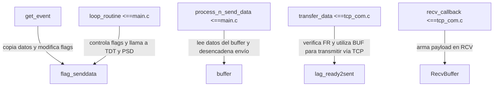

# Interpretación del Contenido de la Reunión "0409"  
**Paso 2 de 3 – Análisis de la reunión y de las funciones relevantes**

## 1. Introducción

En la reunión se presentó una serie de observaciones y explicaciones respecto al funcionamiento del sistema actual, sus módulos, y los puntos críticos que deben abordarse en la siguiente fase del proyecto. El profesor Orlando destacó varias funciones del código fuente, tanto del “código grande” como partes específicas que se encuentran en la implementación actual, enfatizando que podría existir información incompleta o desordenada. El objetivo es consolidar esta información para poder diseñar un subalgoritmo de envío de datos por TCP/IP que maneje grandes volúmenes de información (hasta el punto de sobrepasar la MTU) dividiendo el buffer en paquetes.

## 2. Resumen de Funciones y Requerimientos Mencionados

A continuación se recopilan las referencias a funciones y conceptos, junto con un breve resumen de cada uno:

- **get_event (main.c / MB40Ch_WUART):**  
  - *Propósito:* Toma datos de la memoria y los copia a otra, modificando flags.  
  - *Nota:* Se menciona que la lógica de envío de datos ha sido modificada temporalmente para obtenerlos vía UART.  
  - *Referencia:* Se debe revisar cómo se integran estos datos en el buffer y cómo se activan flags que permitan posteriores llamadas de envío.

- **process_n_send_data (main.c):**  
  - *Propósito:* Esta función se utiliza para leer el buffer completo y preparar los datos que luego serán enviados a través de TCP/IP.  
  - *Importancia:* Es la función clave que transforma la carga de datos almacenados en memoria para su transferencia.  
  - *Acción:* Revisar su interacción con el buffer que se carga en la memoria del FPGA y confirmar la cadena de llamadas a funciones de empaquetado y transferencia.

- **Definiciones en tcp_com.h:**  
  - *Detalle:* Contiene definiciones como `buffer_length` y `PBUF_LENGTH` que actualmente están hardcodeadas.  
  - *Requerimiento:* Sería ideal contar con un mecanismo para conocer este tamaño a priori (por ejemplo, a partir de una configuración o cálculo en tiempo de compilación), lo que facilitaría manejar correctamente la carga de memoria.

- **Flags del Estado de la Máquina:**  
  - *Observación:* Existen flags (como `flag_ready2sent`, `flag_senddata`, etc.) que indican el estado de la comunicación TCP y el manejo del buffer.  
  - *Acción:* Es necesario entender el ciclo y los cambios de estos flags, ya que la solución al problema de sobrepasar la MTU implica un manejo correcto del estado de la conexión y la segmentación de datos.

- **Sistema de Recepción y Generación de Payload (recv_callback):**  
  - *Función:* Cuando llegan datos, se llama a `recv_callback` que crea el payload y copia los datos en `RecvBuffer`.  
  - *Relevancia:* La función debe ser revisada para entender cómo se forman los mensajes y si hay margen para mejorar el manejo de datos entrantes en el contexto de la transferencia de grandes bloques.

- **Loop Principal (loop_routine):**  
  - *Comentario:* Se debe analizar con detenimiento el funcionamiento de `loop_routine`, incluyendo la interpretación de los flags `TcpSlowTimerFlag` y `TcpFastTimerFlag` ya que se menciona que el desarrollador anterior tuvo problemas con ellos.  
  - *Impacto:* Este loop es responsable de llamar periódicamente a las funciones de manejo de la conexión y de procesar los comandos recibidos que afectan directamente la transferencia de datos.

- **Problema y Objetivo Principal:**  
  - *Problema:* Cuando se transfieren muchos datos, se sobrepasa la MTU, lo cual requiere que se haga una correcta segmentación del buffer en varios paquetes.  
  - *Objetivo:* Ajustar y/o reestructurar la lógica de envío (por ejemplo, dentro de `transfer_data`) para que el buffer se separe de manera inteligente y se envíen múltiples paquetes sin pérdida de datos.

- **Aspectos a considerar:**  
  - Posible uso de `malloc` y `memset` para la gestión dinámica y correcta inicialización de memoria.
  - Se sugiere “hardcodear” (dejar datos en alguna cabecera) grandes volúmenes de datos para realizar pruebas que permitan explorar la escalabilidad del sistema.
  - Evaluar si la lógica actual de empaquetado (`snprintf`, concatenaciones con `strcat`, etc.) es la óptima o si se puede optimizar para evitar errores o sobrescrituras cuando se esté trabajando con grandes volúmenes de información.

---

## 3. Relación entre Funciones y Flujos Críticos

A continuación se presenta un diagrama Mermaid que resume la relación entre las funciones más importantes y las interacciones que se deben revisar:

### 3.1 Diagrama: Relación entre Funciones



### 3.2 Diagrama: Flujo del Envío de Datos

```mermaid
flowchart TD
    A[Datos en memoria / adquiridos por get_event] --> B[process_n_send_data]
    B --> C[Buffer se llena con datos procesados]
    C --> D[loop_routine detecta flag_senddata]
    D --> E[transfer_data gestiona buffer y realiza segmentación según tcp_sndbuf]
    E --> F[Envío de paquetes TCP (evitando sobrepasar la MTU)]
```

---

## 4. Acciones Sugeridas a partir de la Reunión

Basado en el análisis y comentarios de la reunión, se proponen las siguientes acciones:

1. **Revisión de Funciones de Adquisición y Envío:**  
   - Reexaminar la implementación de **get_event** y **process_n_send_data** para comprender exactamente cómo se mueven los datos entre la memoria y el buffer que se enviará vía TCP/IP.  
   - Determinar si la transferencia desde el UART afecta la sincronización del envío de datos.

2. **Optimización del Manejo del Buffer:**  
   - Analizar el uso del buffer definido en tcp_com.h, especialmente la constante `buffer_length`, para evaluar si es posible adaptar este tamaño dinámicamente o, al menos, dejar una nota para futuras configuraciones.  
   - Revisar el uso de `snprintf` y `strcat` en la función `packer` para asegurarse de que se manejen de forma segura grandes volúmenes de datos. Considerar alternativas si es necesario.

3. **Gestión de Flags y Timers:**  
   - Analizar en detalle el funcionamiento de `TcpSlowTimerFlag` y `TcpFastTimerFlag` en el `loop_routine`. Verificar si la temporización afecta la segmentación y el envío de datos, dado que existe la hipótesis de que el desarrollador anterior pudo haber tenido problemas en este aspecto.

4. **Manejo de la Segmentación (MTU):**  
   - Concentrarse en la función `transfer_data` para implementar o refinar la lógica de separación en paquetes. Se debe asegurar que, cuando el buffer contenga muchos datos, éstos se dividan en fragmentos del tamaño adecuado según el espacio disponible en `tcp_sndbuf` y, por ende, no se exceda la MTU.
   - Evaluar la posibilidad de implementar un mecanismo de “hardcoding” para generar grandes volúmenes de datos en pruebas, permitiendo iterar y verificar el escalado del sistema.

5. **Validación y Depuración:**  
   - Realizar pruebas unitarias en cada función clave (por ejemplo, en `process_n_send_data`, en la lógica de empaquetado de `packer` y en `transfer_data`), verificando que los flags se actualicen correctamente y que el buffer se llene y se vacíe como se espera.
   - Monitorear la evolución del contenido del buffer durante el envío, mediante logs o mediante gráficos (si es posible integrar herramientas de visualización), para identificar cuellos de botella o problemas de sincronización.

---

## 5. Que nos deja esta reunión?

La reunión dejó en claro que el problema central reside en la correcta transferencia y segmentación de grandes volúmenes de datos mediante TCP/IP, evitando problemas de sobrepasar la MTU.  
Se destacan las siguientes prioridades:

- Comprender y depurar las funciones de adquisición (get_event y process_n_send_data) y las interrelaciones con la lógica de envío (transfer_data, recv_callback, loop_routine).
- Revisar el manejo de los flags y timers (TcpSlowTimerFlag y TcpFastTimerFlag) para asegurar una sincronización adecuada en el envío y recepción.
- Implementar o ajustar el algoritmo de segmentación del buffer en la función transfer_data para que, en caso de datos masivos, se dividan en fragmentos compatibles con la capacidad del buffer TCP.

Esta interpretación servirá como base para el desarrollo del siguiente paso, en el cual se implementarán y probarán los cambios sobre el subalgoritmo de envío masivo de datos en la FPGA Zynq7000.
